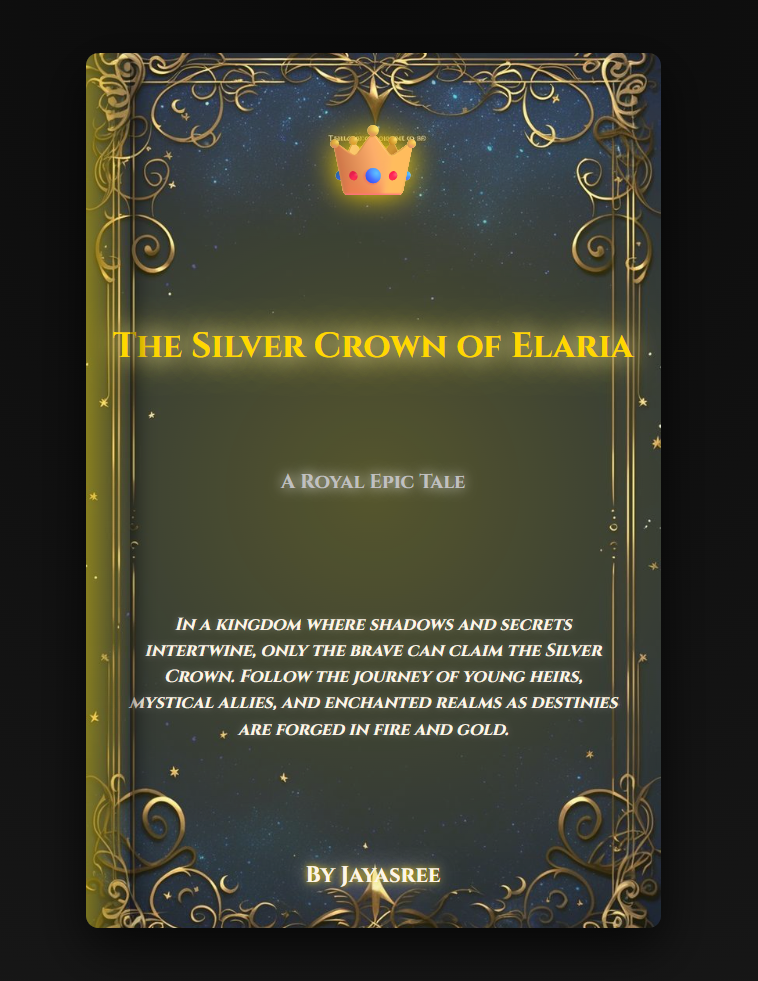

# Ex.06 Book Front Cover Page Design
## Date: 30/10/25

## AIM:
To design a book front cover page using HTML and CSS.

## DESIGN STEPS:

### Step 1:
Create a Django Admin project.

### Step 2:
Create an app in the Django interface.

### Step 3:
Create a folder named 'static' in the app folder.

### Step 4:
Create a new HTML file in the static folder.

### Step 5:
Write the HTML code with relevant CSS properties.

### Step 6:
Choose the appropriate style and color scheme.

### Step 7:
Insert the images in their appropriate places.

### Step 8:
Publish the website in the LocalHost.

## PROGRAM:
```
<!DOCTYPE html>
<html lang="en">
<head>
<meta charset="UTF-8">
<meta name="viewport" content="width=device-width, initial-scale=1.0">
<title>The Silver Crown of Elaria</title>
<style>
  @import url('https://fonts.googleapis.com/css2?family=Cinzel:wght@700&family=Great+Vibes&display=swap');

  body {
    margin: 0;
    padding: 0;
    background: radial-gradient(circle at top, #0a0a0a, #1a1a1a);
    height: 100vh;
    display: flex;
    justify-content: center;
    align-items: center;
    font-family: 'Cinzel', serif;
  }

  .bookcover {
    width: 420px;
    height: 640px;
    border-radius: 10px;
    box-shadow: 0 15px 40px rgba(0,0,0,0.7);
    position: relative;
    overflow: hidden;
    text-align: center;
    color: #fdf5e6;
    display: flex;
    flex-direction: column;
    justify-content: space-between;
    padding: 30px 20px;


    background: url('back.jpg') no-repeat center center;
    background-size: cover;
  }


  .bookcover::before {
    content: "";
    position: absolute;
    top: 0;
    left: 0;
    width: 35px;
    height: 100%;
    background: linear-gradient(to right, rgba(255, 223, 0, 0.4), rgba(255,255,255,0));
    box-shadow: 5px 0 15px rgba(0,0,0,0.5);
    border-radius: 0 10px 10px 0;
    transform: skewY(-2deg);
    z-index: 3;
  }

  
  .sparkles {
    position: absolute;
    top: 0;
    left: 0;
    width: 100%;
    height: 100%;
    background: url('sparkles.png') repeat;
    opacity: 0.25;
    pointer-events: none;
    z-index: 4;
  }


  .rays {
    position: absolute;
    top: -50%;
    left: -50%;
    width: 200%;
    height: 200%;
    background: radial-gradient(circle at center, rgba(255, 223, 0, 0.3), transparent 70%);
    transform: rotate(25deg);
    z-index: 0;
  }

 
  .castle {
    position: absolute;
    bottom: 0;
    width: 100%;
    height: 220px;
    background: url('castle.png') no-repeat center bottom;
    background-size: contain;
    filter: brightness(1.2) drop-shadow(0 0 10px silver);
    z-index: 1;
  }

  .crown {
    font-family: 'Great Vibes', cursive;
    font-size: 70px;
    color: gold;
    text-shadow: 0 0 25px #ffd700, 0 0 50px #fffacd;
    margin-bottom: 10px;
    z-index: 2;
  }

  .title {
    font-size: 28px;
    color: gold;
    text-shadow: 0 0 20px #fffacd, 0 0 30px #ffd700;
    line-height: 1.3;
    margin-bottom: 5px;
    z-index: 2;
  }

  .subtitle {
    font-size: 16px;
    color: silver;
    text-shadow: 0 0 10px #fff;
    margin-bottom: 20px;
    z-index: 2;
  }

  .description {
    font-size: 14px;
    color: #fdf5e6;
    line-height: 1.5;
    text-shadow: 0 0 5px rgba(255,255,255,0.3);
    font-style: italic;
    z-index: 2;
    margin: 0 10px;
  }

  .author {
    font-size: 18px;
    color: #fdf5e6;
    font-weight: bold;
    text-shadow: 0 0 5px gold, 0 0 15px silver;
    margin-top: 20px;
    z-index: 2;
  }

</style>
</head>
<body>
<div class="bookcover">
  <div class="rays"></div>
  <div class="sparkles"></div>

  <div class="crown">👑</div>
  <div class="title">The Silver Crown of Elaria</div>
  <div class="subtitle">A Royal Epic Tale</div>

  <div class="description">
    In a kingdom where shadows and secrets intertwine, only the brave can claim the Silver Crown.  
    Follow the journey of young heirs, mystical allies, and enchanted realms as destinies are forged in fire and gold.
  </div>

  <div class="author">By Jayasree</div>

  <div class="castle"></div>
</div>
</body>
</html>
```


## OUTPUT:


## RESULT:
The program for designing book front cover page using HTML and CSS is completed successfully.
